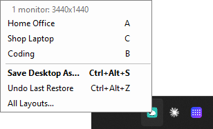
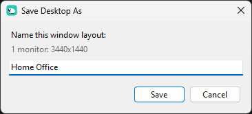
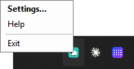
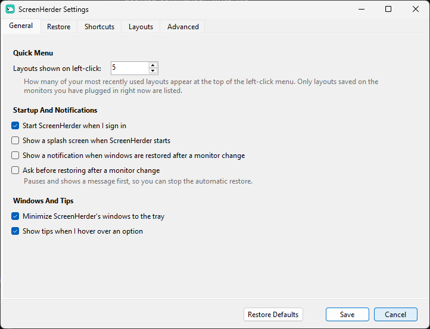
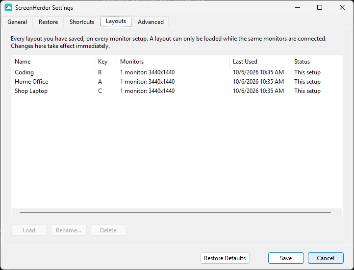

# ScreenHerder

ScreenHerder is a Windows tray app that puts your windows and desktop icons back where they belong when you plug into a different set of monitors.

Move your laptop from the office dock to the home desk and back, and every window lands on the right screen at the right size, and every desktop icon returns to its spot, without you dragging anything. It remembers a separate arrangement for each monitor setup it sees, and lets you save named layouts ("Shop Desk", "Home Coding") and switch between them with one click.

Maintained by John Pozadzides ([johnp.me](https://johnp.me)).

## Download

**[Download the latest ScreenHerder installer](https://github.com/johnpoz/ScreenHerder/releases/latest)**, then on that page click `ScreenHerder-Setup-<version>.exe` under **Assets** and run it.

### "Windows Protected Your PC"

When you run the installer, Windows will warn that it comes from an unknown publisher. That's expected: ScreenHerder is a small personal project, and it isn't signed with a paid code-signing certificate. Click **More info**, then **Run anyway**. Windows then asks for permission to make changes; click **Yes**, which lets the installer set ScreenHerder to start when you sign in.

## How It Works

ScreenHerder lives in the Windows notification area (system tray) as a small sheep. It watches window moves as they happen and records desktop icon positions every few seconds. When a monitor is connected or disconnected, it recognizes the setup and restores the windows and icons it last saw for that exact combination of screens. Icons deleted since leave an empty spot; icons added since stay where they are.


### Left-Click: Quick Menu



- The monitor setup you're on now
- Your most recent saved layouts for those monitors (5 by default, 1 to 20 in Settings), each with a letter
- **Save Desktop As…** names and saves the current windows and icons
- **Undo Last Restore** goes back to how things were before the last layout you loaded
- **All Layouts…** loads, renames or deletes any saved layout, on any monitor setup

While the quick menu is open, a layout's letter restores it and Shift + a letter saves into that slot.



### Right-Click: Settings, Help, Exit



Settings has five tabs:

- **General:** start at sign-in, splash, restore notifications, ask before restoring, minimize windows to the tray, hover tips on or off, how many layouts the quick menu shows
- **Restore:** desktop icons on or off, restore delay, window stacking order, off-screen rescue, taskbar, minimized windows, reopen closed apps
- **Shortcuts:** system-wide keys for the quick menu (Ctrl+Alt+L by default), Save Desktop As, and Undo
- **Layouts:** every saved layout with Load, Rename, Delete
- **Advanced:** apps to ignore, capture delay, extra window tricks, open the data folder

Resting the pointer on any option for 3 seconds shows what it does.





More: [Restore](docs/screenshots/settings-restore.png) · [Shortcuts](docs/screenshots/settings-shortcuts.png) · [Advanced](docs/screenshots/settings-advanced.png)

## Installing

Run ScreenHerder-Setup-<version>.exe. It installs to `%LOCALAPPDATA%\Programs\ScreenHerder`, adds a Start menu entry, optionally a desktop shortcut, and (by default) a sign-in task so ScreenHerder starts with the rights it needs to move every window. It removes the original PersistentWindows first if present. Uninstall from Settings > Apps. The installer is unsigned; see "Windows Protected Your PC" above.

Data lives in `%LOCALAPPDATA%\ScreenHerder`: settings.json, layouts.json, icons.json and the window history database.

## Requirements

Windows 10 or 11 (.NET Framework 4.8, included with both).

## Building

The app compiles on Linux or Windows with the .NET SDK's MSBuild against .NET Framework 4.8 reference assemblies:

```
dotnet build Ninjacrab.PersistentWindows.Solution/Ninjacrab.PersistentWindows.Solution.sln -c Release \
  /p:FrameworkPathOverride=/usr/lib/mono/4.8-api /p:EnableWindowsTargeting=true
makensis -DVERSION=1.2.1 installer/ScreenHerder.nsi
```

`Directory.Build.targets` wires the NuGet references that non-SDK projects otherwise lose outside Visual Studio. See CHANGELOG.md for what changed in each version.

## Credits And License

ScreenHerder includes the window-tracking engine of [PersistentWindows](https://github.com/kangyu-california/PersistentWindows) by Kang Yu and contributors. On top of it, ScreenHerder adds desktop icon restore, named layouts, its tray menus and settings, and the installer. The full upstream history is preserved in this repository.

Licensed under the GNU General Public License v3.0, the same license as PersistentWindows.
